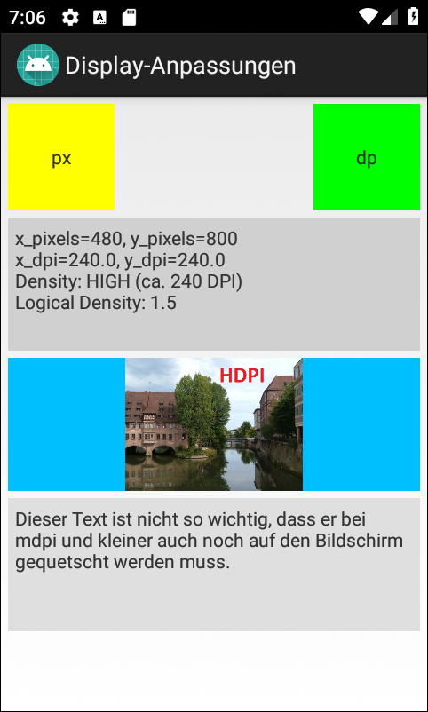

# Android-App "Display-Anpassungen" #

 

App shows possibilities how to adapt to current display (resolution, orientation) at runtime.

 

Identifiers (names for classes, variables and methods), UI texts and Comments (JavaDoc) are in German only.

 

----

## Screenshots ##

 

    

 

 

----

## License ##

 

See the [LICENSE file](LICENSE.md) for license rights and limitations (BSD 3-Clause License).

 
